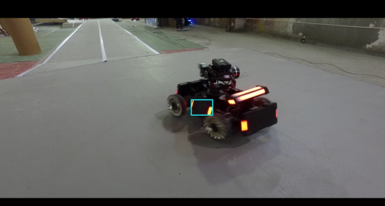
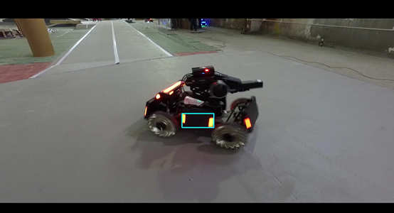

# JUST_HLL_Robomaster_CV
**2019 Jiangsu University Of Science and Techology HLL team Computer Vision Code**

系统总体框图如上，整个目标检测识别过程主要由视频或摄像头读取、图像预处理、装甲板检测、装甲板跟踪、装甲板预测、串口通信、UI设计几部分构成，最终通过 control 模块实现整体算法的实现，主要模块功能如下：

- 图像预处理：主要对图像背景的剔除与目标特征的提取；
- 装甲板检测：对预处理的二值图像进行目标的匹配与筛选，采用多种几何手段；
- 装甲板跟踪：采用 KCF 算法，对检测的目标进行跟踪，提高算法整体的速度；
- 装甲板预测：采用卡尔曼滤波算法，对检测或跟踪的目标进行预测，防止目标漏检或者对运动物体进行预测；
- 串口通信：对算法识别的目标数据进行转发，实现和下位机通信；
- UI设计：对程序中关键参数，比如阈值、摄像头参数进行UI设计封装，方便调试。

整体检测效果如下：

